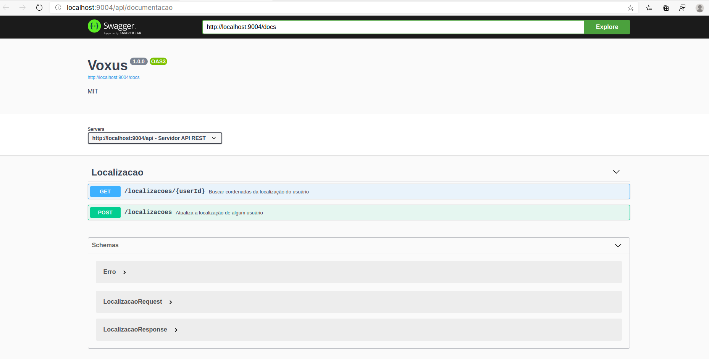
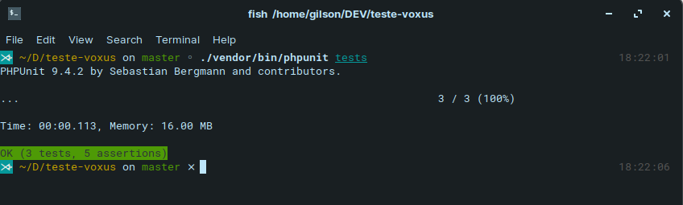

# VOXUS - API de localização do usuário

## Requisitos

Precisamos criar uma API REST que colete dados de localização de milhões de usuários e
consiga retornar para o usuário a posição dele.

- A API receberá latitude e longitude e salvará dados sobre um user_id.
- Quando consultado no método POST, a API deverá armazenar dados da localização do
usuário (banco de dados de sua preferência, inclusive, podendo usar cache ou arquivos
locais).
- É necessário criar um endpoint da API que retornará dados da localização do usuário requisitado.

## Instruções

- Para iniciar a api execute o comando abaixo na raiz do projeto:

    ```shell
    docker-compose -f "docker-compose.yml" up -d --build
    ```

- Após a docker terminar de compilar o sistema estará disponível no seguinte endereço: [http://localhost:9004/api/documentacao](http://localhost:9004/api/documentacao)

- Para executar os testes execute o comando abaixo na raiz do projeto:

    ```shell
    ./vendor/bin/phpunit tests
    ```

## Observações

Esse projeto foi criado usando a linguagem PHP com as seguintes tecnológias:

- Lumen: Estrutura da API
- Sqlite3: Banco de dados
- Swagger 3: Documentação da API
- PHPUnit: Teste automátizado da API

*Por se tratar de um projeto teste não visando segurança e para facilitar o processo de execução os arquivos .env e o banco de dados foram versionado.*

## Imagens do projeto em funcionamento

### Documentação



### Teste


